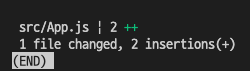
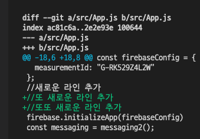

# 7. 임시처리

## 7.1 스태시

워킹디렉토리가 정리되어있지 않은 상태로는 다른 브랜치로 이동할 수 없다.<br>
현재 수정하는 작업을 멈추고 다른 브랜치로 이동하기 위해서<br>
<span style='background:greenyellow; color:black;'>스태시(stash)</span>기능을 사용하여 안전하게 보관 후 이동할 수 있다.

`git stash`


현재 워킹 디렉토리의 내역을 별도의 스택영역에 잠시 저장하고 수정 전인 마지막 커밋상태로 돌아감

### 7.1.1 기존 작업 도중 새로운 변경 요청

#### 스태시 사용 사례

1. 수정 작업 중 다른 수정 요청이 있는 경우
2. 파일을 수정한 후 커밋하지 않고 저장만 하기

### 7.1.2 새 코드 작성 중 기존 코드 수정

3. 기존코드(예 master브랜치)에 버그발견되어 수정요청
4. 현재 브랜치에서의 코드는 불완전한 상태라 커밋을 못함
5. 버그가 있는 브랜치로 checkout하려하나 워킹디렉토리가 클린되지않아 체크아웃 불가

이러한 경우에 사용할 수 있음

### 7.1.3 스태시의 임시 스택 영역에 작업중 코드 저장

코드 수정중이므로 체크아웃 할 수 없다
`stash`는 수정중인 내역을 커밋하지 않고도 브랜치를 이동할 수 있도록 워킹디렉토리를 청소해주고, 현재 작업들을 영구적 커밋이 아닌 임시 스택 영역에 저장한다.

```sh
$ git stash

//혹은, 스태시 여러개를 생성할 때 유용
$ git stash save

// 스태시를 구분할 수 있도록 메시지 추가 가능
$ git stash save "WIP : 메시지~~"

//혹은
$ git stash -m "메시지메시지"
```

> 스태시를 사용하지 않는 경우<br>
강제로 커밋한 후 다시 리셋하여 복원해야하므로 복잡해진다
```sh
$ git commit -am "temp"
// 다른브랜치로 이동..
// 다른 작업...
$ git reset -soft HEAD^
```

#### 스테이지 영역의 파일 제외 하여 stash 생성
`git stash --keep-index`

#### untracked 파일을 포함하여 stash 생성
`git stash --include-untracked`

### 7.1.4 임시 저장 영역의 스택 목록

스태시는 FILO의 스택구조이다

`git stash list`를 통해 저장된 스택을 확인할 수 있다.

스태시는 stash@{번호} 형태로 0번부터 저장된다

`git stash show`를 통해 현재 워킹디렉토리와 스태시된 내용을 간략히 비교할 수 있고 -p옵션을 더하면 git diff처럼 상세히 볼 수 있다.<br>

<br>
show만 했을때<br>
<br>
<br>
show -p일때<br>

### 7.1.5 임시 저장한 스태시 불러오기

작업중이던 브랜치로 이동 한 후 
`git stash pop`

스태시는 스택구조로 저장되므로 pop사용 시 제일 마지막에 저장된 내용을 읽어온다.

스택에서 내용을 읽어올 때 현재 브랜치와 자동으로 병합하고<br>
자동병합이 성공하면 읽어온 내용을 스택에서 제거한다.

> 스태시로 복원 시 워킹디렉토리만 되돌려놓는데, 스테이지에 등록된 스테이지 상태까지 복구하려면 --index옵션을 사용
`git stash apply --index`

### 7.1.6 스태시 복원으로 충돌

스태시 복구 시 현재 브랜치의 워킹디렉토리는 깨끗해야한다. 스태시가 복원될 때 자동으로 병합하기 때문이다.
만약 그렇지 않다면 충돌이 발생할 수 있는데,
복원 도중 충돌이 발생하면 스태시 스택에 저장된 내용은 자동삭제되지 않는다.
충돌이 예상된다면 스태시용 브랜치를 하나 생성해서 작업하는것이 좋다.

- 새로운 브랜치를 생성한 후 스태시를 적용하는 방법

`git stash branch 브랜치이름`

브랜치 생성과 동시에 스태시 임시 작업 내용이 복원되어 저장된다.

### 7.1.7 스태시 복사

스태시 스택에 저장된 항목들은 어느 브랜치에서나 복원이 가능하다.
(master에서 stash 저장하고 feature에서 stash를 복원할 수 있음)
`apply`옵션을 이용해 현재 브랜치로 복원함

```sh
$ git stash apply
```

stash를 복원하는 옵션은 pop과 apply가 있다.
pop은 복원 후 해당 stash가 삭제되고, apply는 삭제되지 않아 다른 브랜치에서도 사용할 수 있다.

test에서 feature브랜치로 이동 후 
git stash list를 해도 stash의 목록이 확인된다.
pop과 달리 apply는 마지막 내용이 아닌, 스택 목록의 중간 작업을 지정할 수 있는데, apply옵션 뒤에 stash@{index}를 통해 사용할 수 있다.

```sh
$ git stash apply stash@{0}

// 스택의 번호를 지정하지 않을 경우
$ git stash apply
// 가장 최신 스태시로 복원됨
```

### 7.1.8 스태시 삭제
충돌발생 혹은 apply를 이용했을 경우 stash가 삭제되지 않는다.<br>
이런 경우 별도로 stash를 삭제해주어야한다.
`git stash drop`
가장 최근 스태시가 삭제됨

## 7.2 워킹 디렉토리 청소

`git clean`명령어를 통해 워킹 디렉토리에 있는 추적되지 않는 파일들을 찾아 삭제

`-f` : 강제 삭제

`-n` : 가상으로 clean명령어를 실행해본 후 사용자에게 확인요청

`-d` : 워킹 디렉토리 삭제 과정에서 새롭게 생성된 파일, 즉 추적되지 않는 파일만 별도로 삭제. 이 옵션은 untracked파일만 삭제함. -f와 함께 사용 가능

`-x` : .gitignore에 등록한 파일은 삭제하지 않는데, 이 파일들도 삭제하기 위해 사용