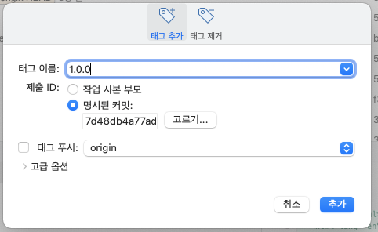

# 배포 관리와 태그

## 10.2 버전

SemVer : (Semantic Version) 유의적 버전
1(메이저).3(마이너).4(패치)
메이저 : 큰 기능이 변경되었을 때
마이너 : 기능을 추가하거나 변경사항이 있을 때
패치 : 버그 수정 등 미미한 변화가 있을 때

## 10.3 태그

특정 커밋을 배포할 수 있도록 특수한 포인터를 제공하는데  
이 포인터를 태그라고 한다.  
태그는 특정 커밋의 해시값을 가리키는 꼬리표역할을 한다.  

- 태그의 종류  
Annotated : 태그이름 + 정보 포함  
Lightweight : 태그 이름만 포함  

## 10.4 태그 목록

```sh
$ git tag -l # 혹은 --list
```

## 10.5 Annotated 태그

### 10.5.1 태그생성

Annotated 태그 생성 시 커밋해시값 + 생성자 정보를 넣을 수 있다.  
(이메일, 날짜, 메세지 정보)  

```sh
$ git tag -a 버전(예 : 1.0.0)
```

`git tag 1.0.0`을 통해 태그를 생성할 경우  
마지막 커밋을 기준으로 생성되며 커밋의 HEAD포인트와 일치함  

- 태그목록 확인
`git tag`

### 10.5.2 간단한 메세지

Annotated 태그 생성 시 작성할 태그정보가 간단할 경우  
-m 옵션을 통해 추가할 수 있음(commit의 -m과 유사)  

```sh
$ git tag -a 1.1.0 -m "simple tag 1.1.0"
```

** 태그 중복 생성 불가 **

### 10.5.5 태그 삭제

```sh
$ git tag -d 태그이름(예 : 1.1.0)
```

### 10.5.6 태그 상세 정보 확인

```sh
$ git show 태그이름 
```

## 10.6 Lightweight 태그

Annotated와 달리 버전이름만 존재

### 10.6.1 체크섬

```sh
$ git tag 태그이름
```

### 10.6.2 태그 상세 정보 확인

```sh
$ git show 1.1.0
```

## 10.7 특정 커밋 태그

`tag`명령어는 현재 HEAD가 가리키고있는 커밋을 기준으로 태그를 생성한다.
<br>
만약 현재 커밋이 아닌 특정 커밋을 지정하여 태그를 생성하려면

`git tag -a 태그버전 커밋ID`을 통해서 태그를 생성할 수 있다.
<br>

### 10.7.1 소스트리에서 특정 커밋 지정

특정 커밋에서 마우스 오른쪽 -> 태그 -> 명시된 커밋 -> 추가




## 10.8 태그를 사용한 체크아웃

태그는 특정 커밋을 가리키는 포인터이므로 태그를 이용해 특정 커밋으로 체크아웃할 수 있다.
<br>
체크아웃 시 브랜치 이름 대신 태그이름을 입력하면 된다.
<br>

`git checkout 태그이름`
<br>
단, 체크아웃 후 브랜치처럼 추가커밋을 작성할 수 없다(브랜치와 달리 단순한 포인터이므로)
<br>

## 10.8.1 태그 브랜치

태그로 체크아웃 시 추가 커밋 작성 불가하므로, 추가 커밋 작업이 필요하다면 태그를 기반으로 새 브랜치를 작성한다.

```sh
$ git checkout -b 브랜치이름 태그이름

# hotfix라는 이름으로 1.1.0태그에서 브랜치를 만든다면

$ git checkout -b hotfix 1.1.0
```

## 10.9 태그 공유

로컬에서 생성한 태그는 원격에 자동공유되지 않으므로 push명령어를 통해 공유한다.

### 10.9.2 태그 동기화

```sh
# 브랜치 동기화
$ git push origin 브랜치이름

# 태그 동기화
$ git push origin 1.1.0

```

### 10.9.3 전체 태그 동기화

`--tags`옵션을 통해 로컬 저장소의 전체 태그를 한번에 push할 수 있다.

```sh
$ git push origin --tags
```

### 10.9.4 원격에서 태그 수정과 삭제

**수정은 현재 책에 나온 위치에 존재하지 않아 찾질 못하고있음**

- 삭제
```sh
$ git push --delete origin 1.1.0
```
원격저장소에서 삭제했다하더라도 로컬에는 태그가 남아있으므로<br>
로컬의 태그도 삭제해주어야한다.
```sh
$ git tag -d 1.1.0
```

### 10.9.5 원격에 다른 이름으로 태그 저장

브랜치를 다른 이름으로 저장하는 원리처럼 태그도 다른 이름으로 저장가능

```sh
# branch를 다른 이름으로 저장
$ git push origin hotfix:fix

# tag를 다른 이름으로 원격에 저장
$ git push 1.1.0:3.0.0
```

