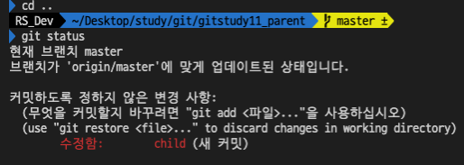

# 11 서브 모듈

## 11.1 대형 프로젝트

### 11.1.1 저장용량

깃 호스팅 서비스는 저장소 용량을 제한한다(1GB정도)<br>
로컬의 경우 한계가 없다.<br>

### 11.1.2 저장소 분리

규모가 큰 프로젝트의 경우 필요에 맞게 작은 저장소로 분할해서 관리하는것이 효율적이다.<br>
저장소 하나를 작은 몇개로 분할할 수 있는데, 이를 서브모듈이라고 한다.<br>
서브모듈은 저장소 하나가 다른 깃 저장소를 포함하는 형태를 의미한다.<br>
작게 나뉜 모듈형태의 저장소는 다른 프로젝트에서도 재사용할 수 있다.<br>

### 11.1.3 상하관계

독립된 깃 저장소는 모듈로서 메인 저장소와 결합하여 재사용하게되는데,<br>
부모 저장소와 자식 저장소의 관계로 나뉜다.<br>

## 11.2 실습준비

gitstudy11_parent와 gitstudy11_child 프로젝트 생성, 원격의 repository생성하여 push한다


## 11.3 서브모듈 추가

서브모듈은 2개 이상인 저장소를 부모와 자식관계로 연결한다.

### 11.3.1 저장소 연결

`add`옵션을 이용해 서브저장소를 서브폴더 형태로 취급할 수 있다.

```sh
# parent 저장소에서
$ git submodule add 자식의_원격저장소_주소 폴더이름

$ git submodule add https://...../gitstudy11_child child
```

위 명령어 실행 시 .gitmodules와 child폴더가 생성된다.<br>

### 11.3.2 설정파일

root경로에 .gitmodules 파일이 생성되는데, 이 파일은 현재 저장소와 연결된 자식저장소를 관리한다.<br>

```sh
$ cat .gitmodules
[submodule "child"]
    path = child
    url = https://github.com/deveq/gitstudy11_child.git
```

### 11.3.3 모듈 커밋

생성된 폴더인 child를 제외하고 .gitmodules만 add하여 커밋한다.

```sh
$ git add .gitmodules

$ git commit -m "add submodule"
```

## 11.4 서브모듈 작업

### 11.4.1 모듈 저장소

parent/child 폴더 내에도 .git파일이 있다.<br>
(parent와 child는 별개의 git으로 관리됨을 알 수 있다)<br>

### 11.4.2 모듈상태


<br>
(child수정 -> commit을 한 후 parent에서 git status를 함)<br>
child에 새 커밋이 추가되었을 경우 (새 커밋)이라고 뜨고<br>
수정만 된 경우라면 (수정한 내용)이라고 뜸

서브모듈로 등록된 child를 수정할 경우<br>
parent에서 커밋을 하는것이 아닌, child 폴더에서 커밋을 해야한다.
(독립적으로 git이 관리되므로)

서브모듈은 원격 저장소와 연결되어있기 때문에 저장소마다 푸시해야한다.

