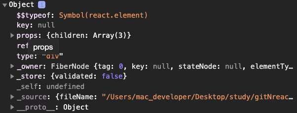
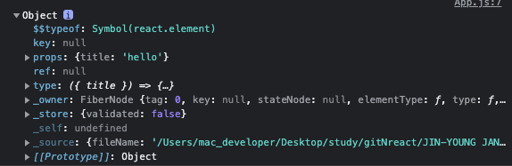

## 3.1 상태값과 속성값으로 관리하는 UI데이터

UI데이터  
- state(상태값) : 컴포넌트 내부에서 관리되는 값  
- props(속성값) : 부모 컴포넌트로부터 내려받는 값

### 3.1.1 리액트를 사용한 코드의 특징

UI코드와 기능을 나타내는 코드가 분리되어있어  
비즈니스로직에 좀 더 집중할 수 있다.

### 3.1.2 컴포넌트의 속성값과 상태값

상태값 : 해당 컴포넌트가 관리하는 데이터  
속성값 : 부모로부터 전달받는 데이터  

UI데이터는 반드시 상태값과 속성값으로 관리되어야한다.  
그렇지 않을 경우 데이터가 변경되어도 화면이 갱신되지 않을 수 있다.

```js
function Todo() {
    const [ count, setCount ] = useState(0);
    const onClick = () => {
        setCount(count +1);
    };

    return (
        <div>
            <Title title={`현재 카운트 ${count}`} />
            <button onClick={onClick}>증가</button>
        </div>
    )
}

//////
function Title({title}) {
    return <div>{title}</div>
}

export default React.memo(Title);

```

1. 속성값은 부모로부터 전달받는다.  
만약 속성값이 변경되면 부모는 다시 렌더링이 되는데,  
부모가 렌더링되면서 자식도 다시 렌더링이 되므로  
Title의 입장에서는 title값이 변경되지 않더라도 다시 렌더링된다.  
이를 방지하기 위해서 React.memo를 사용하면  
prop가 변경될때만 렌더링되게 변경해줄 수 있다.

2. 각 컴포넌트는 상태값을 위한 자신만의 공간이 있어  
같은 컴포넌트가 여러개 생성되었다하더라도  
독립적으로 자신만의 상태값을 사용할 수 있다.

3. 속성과 상태값은 불변으로 관리해야한다.  
    속성은 immutable, 상태값은 mutable이다  
    하지만 mutable이라 하더라도 불변처럼 관리해야한다.  
    리액트는 두 값을 변경시키더라도 참조값이 변경되지 않는다면  
    달라졌다고 인식하지 못하기 때문에 화면이 다시 렌더링되지 않는다.


### 3.1.3 컴포넌트 함수의 반환값

1. 컴포넌트 및 HTML의 거의 모든 태그
2. 숫자, 문자열
3. 배열 (각 인자에 unique한 key값 필수)
4. 프래그먼트 < fragment> 혹은 < >
5. null, boolean (렌더링되지 않음)
6. 리액트 포털(위치와 상관없이 특정 돔요소에 렌더링 가능)

## 3.2 리액트 요소와 가상돔

리액트는 렌더링 성능을 위해 가상돔을 사용한다.  
빠른 렌더링을 위해 돔 변경을 최소화해야하므로  
메모리에 가상돔을 올려놓고 이전과 이후를 비교해서  
변경된 부분만 실제 돔에 반영한다.  

### 3.2.1 리액트 요소 이해

JSX 문법으로 작성된 코드는 createElement 함수로 변경되고  
createElement 함수는 리액트 요소를 반환한다.  

```js
const element = React.createElement(
    'a',
    { href : 'https://.....'},
    'click here'
)
console.log(element)
```


```js
const Title = ({title}) => (
    <div>
        내용
    </div>
)
console.log(Title)
```
Component가 반환하는 요소


type속성이 문자열일 경우 HTML태그를,  
함수면 컴포넌트를 나타낸다.

key, ref를 제외한 나머지 속성들은 props로 들어간다  
(그래서 key, ref를 props로 접근하면 에러 발생하는거)
JSX에서 사용된 Title컴포넌트는 리액트 요소의 type속성값에 입력되고,  
속성값으로 전달된 함수를 호출해 화면을 그리기위한 정보를 얻을 수 있다.

리액트는 전달된 리액트 요소를 이전의 요소와 비교하여  
변경된 부분만 실제 돔에 반영한다.  

```js
let second = 0;
function update() {
    second += 1;
    const element = (
        <div>
            <h1>안녕하세요</h1>
            <h2>지금까지 {second}초가 지났습니다.</h2>
        </div>
    )
    ReactDOM.render(element, document.getElementById('root'));
}

setInterval(update, 1000); //1초마다 한번씩 update호출
```
리액트가 새로운 리액트 요소를 1초마다 받으면,  
이전의 리액트 요소와 비교하여 변경된 부분만 실제 돔에 반영한다.  
여기에서 리액트는 실제돔의 h1요소는 건드리지 않는다.  

### 3.2.2. 리액트 요소가 돔 요소로 만들어지는 과정

리액트에 의한 화면 업데이트는 렌더단계와 커밋단계를 거친다  
렌더단계 : 
실제 돔에 반영할 변경 사항을 파악하는 단계
변경사항을 파악하기 위해 가상돔을 사용한다.  

커밋단계 : 파악된 변경사항을 실제 돔에 반영하는 단계


## 3.3 리액트 훅 기초 익히기

### 3.3.1 상탯값 추가 : useState

### 3.3.2 부수효과 처리 : useEffect

### 3.3.3 훅 직접 만들기

### 3.3.4 훅 사용 규칙

