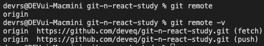
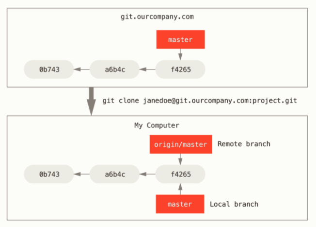
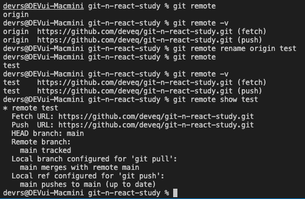

# 5장. 서버

## 5.1 서버 저장소
- remote, 원격 저장소라고도 불리며, 로컬 저장소의 코드를 복제한 복사본
- 로컬 저장소의 불안정성을 보완, 코드를 안전하게 보관할 수 있음
- 원격 저장소의 소스 코드는 공유와 협업의 시작점
### 5.1.1 분산형 모델
- 협업과 인터넷 연결 상태의 다양한 개발 환경을 위해 채택
### 5.1.2 작업의 연속성 보장
- 원격 저장소에 업로드하고, 로컬 저장소와 동기화를 통해 작업을 연속적으로 진행할 수 있음
### 5.1.3 공유의 편리성
- 깃의 원격 저장소 주소를 공유함으로서, 최신 상태의 코드 공유 가능

#
## 5.2 원격 저장소 설정
### 5.2.1 깃허브
- 대표적인 깃호스팅 서비스로 무료
- 사용자의 이름이 곧 본인의 원격 저장소 홈 주소를 결정함
- ex : https://github.com/ssahn0806
- 프로젝트 별 저장소는 공개형,비공개형으로 설정할 수 있음
- ex : https://github.com/deveq/git-n-react-study
#
## 5.3 동기화
- 새로운 로컬 저장소(git init)를 생성하고, 원격 저장소로 연결
- 기존 저장소를 연결

### 5.3.2 프로토콜
- 서버와 통신하기 위한 통신 규약으로 Local,HTTP,SSH,Git을 지원함

Local : 로컬 컴퓨터에 원격 저장소를 생성하는 것. 하나의 PC를 서버로 사용

|장점|단점|
|---|---|
|- 간단한 원격 서버 구축, 빠른 동작|- 모든 자료가 해당 PC에 모두 저장됨|

HTTP : 깃허브가 기본적으로 지원하는 프로토콜, 아이디와 비밀번호로 사용자 인증

SSH : 깃에서 권장하는 프로토콜, 높은 수준의 보안 통신으로 처리함. 인증서를 만들어 처리하며, 공개키는(서버) 개인키(로컬)에 저장.

|공통점|차이점|
|---|---|
|사용자 인증이 필요함|로그인/인증서|

Git : 깃의 데몬 서비스를 위한 전용 프로토콜, SSH와 유사하나 인증 시스템 부재.

## 5.3.3 원격 저장소 관리
### git remote
- 현재 연결된 원격 저장소 목록 확인
- 원격저장소 등록/취소

- 복수의 원격 저장소를 연결할 수 있으나, 권한 정보까지는 알 수 없음
- 서버 주소의 대표적 별칭 : origin

### 연결하기
git remote add origin https://github.com/deveq/git-n-react-study.git

- fetch : download
- push : upload

- master : 현재 로컬 저장소, origin/master : 원격 저장소의 브랜치를 의미함.
- 원격 저장소를 등록하면, 원격 브랜치가 자동 생성된다.

- 별칭의 이름을 변경하거나, 상세한 정보를 원하는 경우에 사용하는 명령어

### 삭제하기
- git remote rm name
#
## 5.4 업로드
로컬 저장소의 커밋을 원격 저장소로 전송하는 방법
- 로컬 저장소와 원격 저장소가 연결된 상태가 전제조건임.

### 5.4.1 push
- git push name branch_name
- 자신의 로컬 작업물의 백업으로 원격 저장소를 사용할 수 있음.
#
## 5.5 다운로드
원격 저장소의 커밋 내역을 로컬 저장소로 내려받는 방법
### 5.5.1 clone
- 기존 저장소를 이용하여 새로운 저장소를 생성하는 방법 중 하나
- 일반 폴더 복사나, github의 Download ZIP과는 아래와 같은 차이점이 있음

1. git이 추적가능한 상태인 git init을 자동으로 수행
2. 해당 저장소와 매칭되는 원격저장소의 연결을 자동으로 수행

* git clone url new_name

new_name을 입력하지 않으면, 원격 저장소의 프로젝트 이름으로 폴더가 생성됨.

### 5.5.2 pull
원격 저장소와 연결된 로컬 저장소에 대하여, 원격 저장소의 갱신된 내용을 추가로 내려받는 경우에 사용함
- git pull
#
## 5.6 Pull or Fetch?
|Pull|Fetch|
|---|---|
|원격 저장소의 HEAD가 로컬 저장소의 HEAD보다 AHEAD인 경우 내려받고, 자동으로 병합| 협업과정에서 자동 병합이 불가능한 경우 사용|
### 5.6.1 Pull
- 내려받은 최신 정보를 임시 영역에 저장하고 현재 브랜치와 병합 처리를 진행
### 5.6.2 Fetch
- 임시 브랜치로 내려 받고, 자동 병합하지 않음
- 임시 브랜치에는 커밋을 할 수 없음
### 5.6.3 Merge
- git merge target_branch_name
#
## 5.7 Up to Date
- 원격 저장소에 내 로컬 저장소의 커밋 내역을 업로드 하기 위해서는, 원격 저장소의 상태를 먼저 가지고 있어야 한다.

- git pull / fetch - git commit - git pull / fetch (git merge)- git push